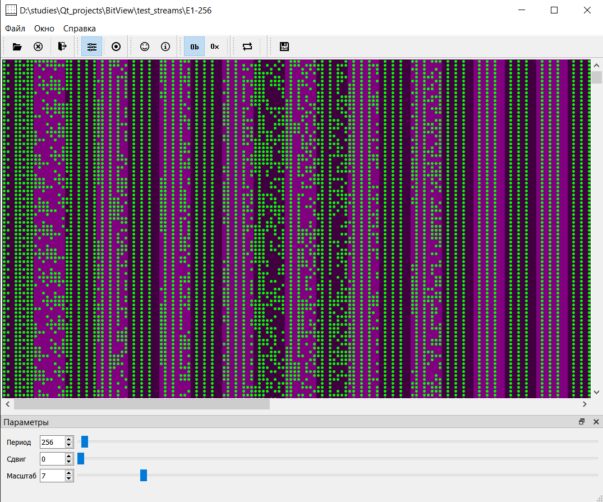
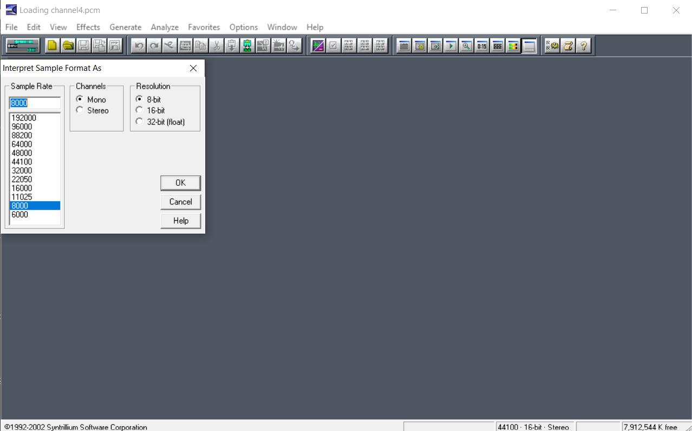
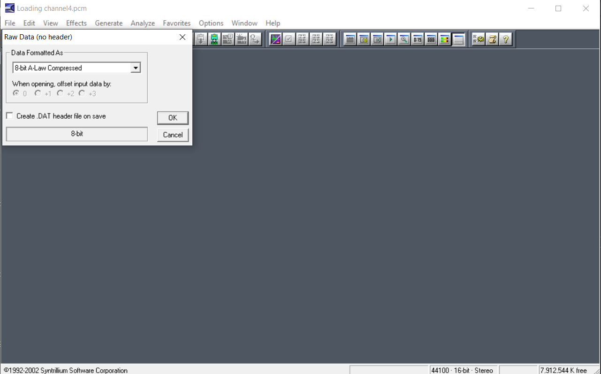
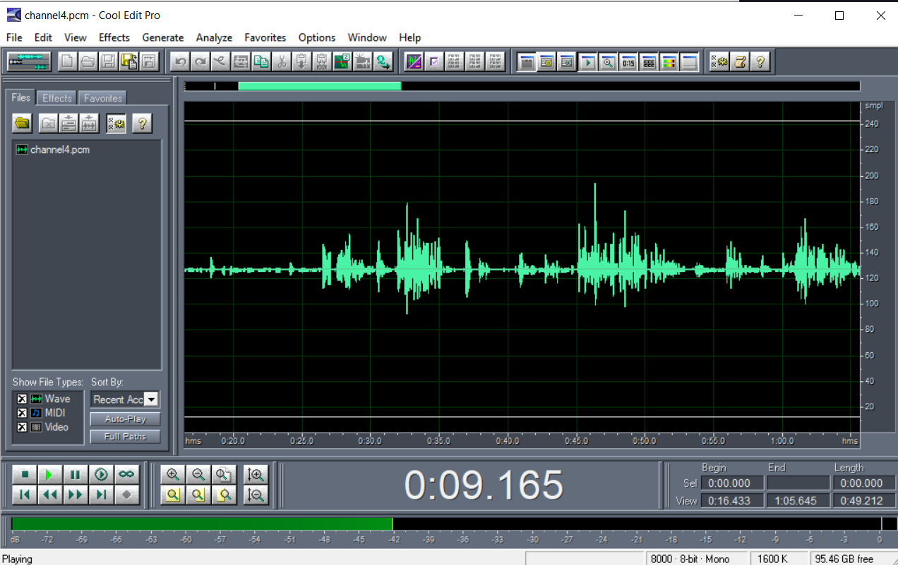

# BitView

Приложение для визуального анализа бинарных файлов.

## Особенности проекта

**BitView** - это специализированное приложение для анализа бинарных файлов, разработанное на фреймворке Qt. Основная особенность программы заключается в уникальном способе визуализации данных - "матрасной" развертке, которая позволяет:

- **Визуализировать битовый поток** в виде цветного "матраса" с периодической разверткой
- **Анализировать паттерны** в бинарных данных путем цветового кодирования битов (0/1)
- **Масштабировать отображение** для детального изучения отдельных участков
- **Демультиплексировать каналы** из потока данных в отдельные файлы

### Основные возможности

- **Два режима отображения:**
  - Битовый режим (Bit View) - каждый бит отображается отдельным пикселем
  - Шестнадцатеричный режим (Hex View) - данные группируются по 4 бита
  
- **Обработка данных:**
  - Сдвиг битов для анализа с разных позиций
  - Реверс байтов (инвертирование порядка битов)
  - Демультиплексирование каналов


## Архитектура MVC

Проект реализован с использованием паттерна **Model-View-Controller (MVC)** с дополнительным слоем делегатов для гибкой системы отображения.

### Model (Модель)
```cpp
class Model : public QObject
```
**Ответственность:**
- Управление доступом к данным файла
- Кэширование данных (чтение по страницам по 16MB)
- Обработка сдвига битов и реверса байтов
- Демультиплексирование каналов

**Ключевые методы:**
- `getBits()` - получение массива битов для отображения
- `setShift()` - установка сдвига битов
- `setReverse()` - включение/выключение реверса
- `demultiplexChannel()` - извлечение канала в отдельный файл

### Viewer (Вид)
```cpp
class Viewer : public QWidget
```
**Ответственность:**
- Отображение данных в виде "матраса"
- Обработка пользовательского ввода (мышь, колесо)
- Управление прокруткой и масштабированием

**Особенности:**
- Кастомная отрисовка с использованием QPainter
- Поддержка drag-and-drop для навигации
- Автоматическое обновление при изменении данных

### Delegate (Делегат отображения)
```cpp
class BaseDelegate : public QObject
```
**Иерархия делегатов:**
- `BaseDelegate` - абстрактный базовый класс
- `BitDelegate` - делегат для битового отображения
- `HexDelegate` - делегат для шестнадцатеричного отображения

**Ответственность:**
- Определение цветов для отображения битов/символов
- Расчет размеров элементов отображения
- Отрисовка отдельных строк данных

## Сборка проекта

### Требования
- **Qt Framework** 5.x или выше
- **Компилятор C++11** (MinGW, MSVC, GCC)
- **Qt Creator** (рекомендуется) или qmake

### Команды сборки

1. **Открыть проект в Qt Creator:**
   ```
   Открыть файл Mattress-2025-2.pro
   ```

2. **Сборка через qmake:**
   ```bash
   qmake Mattress-2025-2.pro
   make
   ```

## Пример использования
### Главное окно приложения

### Демультиплексирование выбранного канала

### Использование CoolEdit для обработки выделенной информации


